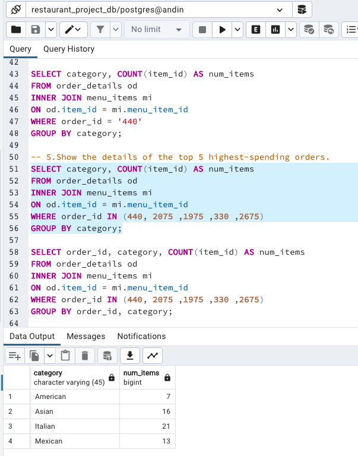

# 🍽️ Restaurant SQL Basic Data Analysis

A basic data exploration project using PostgreSQL to analyze customer behavior and menu performance from restaurant orders data.

---

## 📊 Objective

To gain insights from restaurant transactional data by exploring ordering trends and menu profitability.

---
## 📂 Dataset Source

The dataset used in this project is provided by [Maven Analytics](https://www.mavenanalytics.io/) as part of their free data projects for learning purposes.

## 🧾 Dataset

This project uses two main tables:

- `menu_items`: Contains item names, categories (e.g., Italian, Asian), and prices.
- `order_details`: Contains order IDs, order time, and items ordered.

---

## 🔍 Key Findings

✅ **Italian dishes are the priciest** on the menu  
✅ **Hamburgers** (American) and **Edamame** (Asian) are the most ordered items  
✅ Among the **top 5 highest-spending orders**, most items were **Italian dishes**

---

## 💡 Insight

Despite being more expensive, **Italian food consistently attracts high-spending customers**.

---

## 📌 Recommendation

**Keep Italian dishes on the menu.** They're not just profitable — they're a top choice for **high-value customers** who generate significant revenue.

---

## 📸 Preview

